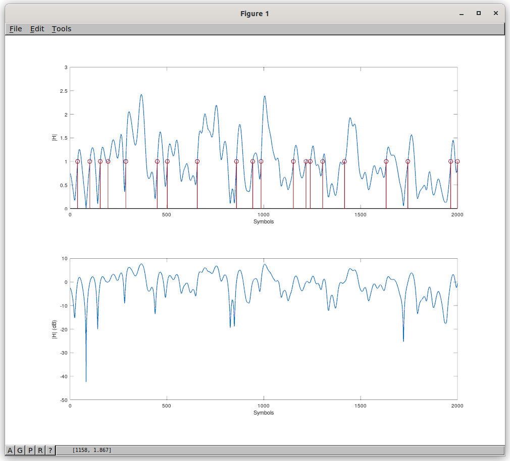

# Radio Autoencoder - Baseband FM (BBFM)

A version of the Radio Autoencoder (RADE) designed for the baseband FM channel provided by DC coupled and passband FM radios, e.g. land mobile radio (LMR) VHF/UHF use case.

# BBFM ML encoder/decoder

Quickstart - ignore the first two steps (training), and use pre-trained `250319_bbfm_lmr60` model.

1. Generate 10 hours of fading samples for training:
   ```
   octave:67> multipath_samples("lmr60",8000, 2000, 1, 10*60*60, "h_lmr60_train.f32")
   ```
   Note 10 hours << 205 hours in the speech training dataset.  The same fading data is therefore repeated 205/10 times in each training epoch. I think 10 hours or so might be the max I can generate due to memory limitations in the current Octave code (TBC). It should be enough, based on argument for dataset length with similar models used for HF fading (ITU-R F.1487) which suggests a test length of 3000*(1/Doppler Spread Hz), which for 60 km/hr is 3000/25 = 120 seconds.

1. Training with fading (multipath):
   ```
   python3 ./train_bbfm.py --cuda-visible-devices 0 --sequence-length 400 --batch-size 512 --epochs 100 --lr 0.003 --lr-decay-factor 0.0001 --plot_loss ~/Downloads/tts_speech_16k_speexdsp.f32 250319_bbfm_lmr60 --RdBm -100 --plot_loss --range_RdBm --h_file h_lmr60_train.f32
   ```

1. Inference (runs encoder and decoder, plays result to sound card, and outputs symbols `z_hat.f32`):
   ```
   ./bbfm_inference.sh 250319_bbfm_lmr60/checkpoints/checkpoint_epoch_100.pth wav/brian_g8sez.wav - --write_latent z_hat.f32
   ```
1. Inference (-120dBm, fading, per sample Rx levels written to r.f32 for plotting):
   ```
   octave:67> multipath_samples("lmr60", 8000, 2000, 1, 60, "h_lmr60.f32")
   ./bbfm_inference.sh 250319_bbfm_lmr60/checkpoints/checkpoint_epoch_100.pth wav/brian_g8sez.wav - --h_file h_lmr60.f32 --RdBm -120 --write_RdBm r.f32
   ```
1. Stand alone decoder, outputs speech from `z_hat.f32` to sound card:
    ```
    ./bbfm_rx.sh 250319_bbfm_lmr60/checkpoints/checkpoint_epoch_100.pth z_hat.f32 -
    ```
1. Or save speech out to a wave file:
    ```
    ./bbfm_rx.sh 250319_bbfm_lmr60/checkpoints/checkpoint_epoch_100.pth z_hat.f32 t.wav
    ```

1. Streaming decoder, reads a stream of z_hat float[80] vectors and synthesises decoded speech:
   ```
   cat z_hat.f32 | python3 bbfm_rx_stream.py 250319_bbfm_lmr60/checkpoints/checkpoint_epoch_100.pth | build/src/lpcnet_demo -fargan-synthesis - - | aplay -f S16_LE -r 16000
   ```

1. Plot sequence of received symbols:
    ```
    octave:4> radae_plots; do_plots_bbfm('z_hat.f32')
    ```

# Faded (multipath) channel simulation

HF channel sim (two path Rayleigh) is pretty close to TIA-102.CAAA-E 1.6.33 Faded Channel Simulator. The measured level crossing rate (LCR) seems to meet req (f), for v=60 km/hr, f = 450 MHz, and P=1 when measured over a 10 second sample. We've used Rs=2000 symb/s here, so x-axis of plot is 1 second in time.



```
octave:39>  multipath_samples("lmr60",8000, 2000, 1, 10, "h_lmr60.f32")
Generating Doppler spreading samples...
fd = 25.000
path_delay_s = 2.0000e-04
Nsecplot = 1
Pav = 1.0366
P = 1
LCR_theory = 23.457
LCR_meas = 24.400
```

You can also generate fading samples with other speeds, e.g. 10 seconds of 120 km/hr:
```
octave:93> multipath_samples("lmr120", 8000, 2000, 1, 10, "h_lmr120_train.f32")
```

# Single Carrier PSK Modem

A single carrier PSK modem "back end" that connects the ML symbols to the radio.  This particular modem is written in Python, and can work with DC coupled and passband BBFM radios. It uses classical DSP, rather than ML.  Unlike the HF RADE waveform which used OFDM, this modem is single carrier.

1. Run a single test with some plots, Eb/No=4dB, 100ppm sample clock offset, BER should be about 0.01:
   ```
   python3 -c "from radae import single_carrier; s=single_carrier(); s.run_test(100,sample_clock_offset_ppm=-100,plots_en=True,EbNodB=4)"
   ```
1. Run a suite of tests:
   ```
   ctest -V -R bbfm_sc
   ```
1. Create a file of BBFM symbols, 80 symbols every 40ms, plays expected output speech:
    ```
    ./bbfm_inference.sh model_bbfm_01/checkpoints/checkpoint_epoch_100.pth wav/brian_g8sez.wav - --write_latent z.f32
    ```
2. Sanity check of modem, BER test using digital, BPSK symbols, the symbols in z.f32 are replaced with BPSK symbols. `t.int16` is a real valued Fs=9600Hz sample file, that could be played into a FM radio.
   ```
   cat z.f32 | python3 sc_tx.py --ber_test > t.int16
   cat t.int16 | python3 sc_rx.py --ber_test --plots > /dev/null
   ```
3. Send the BBFM symbols over the modem, and listen to results:
    ```
   cat z.f32 | python3 sc_tx.py > t.int16
   cat t.int16 | python3 sc_rx.py > z_hat.f32
   ./bbfm_rx.sh model_bbfm_01/checkpoints/checkpoint_epoch_100.pth z_hat.f32 -
    ```
4. Compare MSE of features passed through the system, first with z == z_hat, then with z passed through modem to get z_hat:
   ```
     python3 loss.py features_in.f32 features_out.f32
     loss: 0.033
     python3 loss.py features_in.f32 features_rx_out.f32
     loss: 0.035
   ```
  This is a really good result, and likely inaudible. The `feature*.f32` files are produced as intermediate outputs from the `bbfm_inference.sh` and `bbfm_rx.sh` scripts.

5. Playing samples over a USB sounds card connected to a radio, note selection of sample rate:
   ```
   aplay --device="plughw:CARD=Audio,DEV=0" -r 9600 -f S16_LE t1.int16
   ```

6. Feeding samples from an off air wave file captured from a Rx to demod. Note `sc_xx` tools default to a centre freq of 1500Hz
   ```
   sox ~/Desktop/sc-ber-003.wav -t .s16 -r 9600 -c 1 - highpass 100 | python3 sc_rx.py --plots > z_hat.f32
   ```