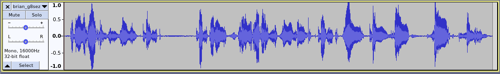
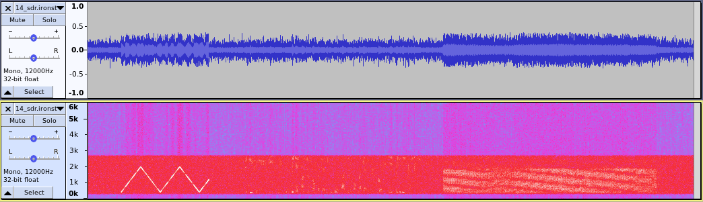

# Stored File Test Procedure

This document is a test procedure for the August 2024 RADAE stored file test campaign.  The general idea is to take a 10 second sample of input speech, then send it over a HF radio channel as compressed SSB and RADAE.  This allows a side by side comparison using the same speech, over approximately the same channel conditions.  Using a stored file makes it possible to repeat the experiment in a controlled fashion over several trials, for example with varying power levels of different receiver locations. As background a similar campaign was conducted in [April 2024](https://freedv.org/?p=595).

## Preparing a file for Tx

1. [Install](../README.md#installation) the RADAE software.
1. Record a wave file of your own voice, for example, "Hello, this is VK5XYZ testing the radio Autoencoder 1 2 3 4".
1. The wave file format required is 1 channel, 16 kHz, 16 bit signed integer.
1. We suggest about 10 sec long but feel free to experiment.  The length is not critical.
1. Try to make the peak level between about half way and the clipping level.
   
1. Use a headset microphone and try to avoid room echo and background noise. Don't use a laptop microphone.
1. As examples, there are samples from other hams in `radae/wav`
1. Use `ota_test.sh` to create a `tx.wav`, this consist of chirp-compressed SSB-radae:
   ```
   ota_test.sh -x vk5xyz.wav
   ```
1. You can listen to and plot `tx.wav` with your favorite waveform editor, you can see the signals are adjusted to have the same peak level. The SSB compression gain can be adjusted using the `-g` option; `-g 6` is the default.  Trying going up or down 3dB.  A quieter sample may benefit from more compression.
   

## Transmitting your sample

1. Configure your SSB radio with voice compressor off.  The Tx audio path must be "clean" with no additional processing.
1. The sound card levels should be adjusted to "just move the ALC".
1. Tune the remote receiver (I use a KiwiSDR) to your SSB radio frequency.  You need to be within +/- 50 Hz for the RADAE receiver to acquire.
1. Start transmitting. You can do this manually by playing tx.wav through your transmitter, or use `ota_test.sh`
   ```
   ./ota_test.sh wav/david_vk5dgr.wav -d -f 14236
   ```
   You can adjust the hamlib rig and serial port with command line options, to get help: `ota_test.sh -h`
1. After you start transmitting quickly start the KiwiSDR recording.
1. When you hear transmission stop on the KiwiSDR, stop recording.
1. The KiwiSDR file will be downloaded.
1. Place a serial number in front of the downloaded file to easily identify it e.g. `14_`. Make your own notes of the conditions for that sample (e.g. rx station location, distance, power level, anything else you think is relevant)
1. It's useful to load the file into your waveform viewer.  I find spectrogram mode useful.
   
1. The RADAE receiver will search for the location of the chirp in the first 10 seconds of the sample.  Make sure there is no more than 6 seconds of noise before the chirp starts.  If necessary, edit the file by removing any excess before the chirp starts.
1. If there is more than a few seconds after the RADAE signal stops, clip that off the sample too.
1. Process the received sample:
   ```
   ./ota_test.sh -r ~/Downloads/14_sdr.ironstonerange.com_2024-08-08T05_10_14Z_7175.00_lsb.wav
   ```
1. This will locate the chirp, print the C/No and SNR in dB, and generate several other files in the same directory, `_ssb.wav`, `_radae.wav` and a spectrogram `_spec.jpg`.  The mesured C/No and SNR will be in `_report.txt`.
1. Note the C/No, SNR, and listen to the results, comparing SSB to RADAE.
1. Try to collect some interesting results, for example different channels and power levels, cases where RADAE fails to acquire, intercontinental DX, fast and slow fading, co-channel interference, interference from carriers.

## Receiver log fields

For example:

```
43 state: candidate  valid: 1 0  2 Dthresh:     9.55 Dtmax12:    15.67     4.01 tmax:  596 tmax_candidate:  596 fmax: -12.50
44 state: candidate  valid: 1 0  3 Dthresh:     9.34 Dtmax12:    15.08     4.01 tmax:  596 tmax_candidate:  596 fmax: -12.50
45 state: sync       valid: 1 0 25 Dthresh:     8.45 Dtmax12:    12.70     2.56 tmax:  596 tmax_candidate:  596 fmax: -10.98 auxbits: [0 0 0] uw_errors: 0
46 state: sync       valid: 1 0 25 Dthresh:     8.35 Dtmax12:     8.92     1.48 tmax:  596 tmax_candidate:  596 fmax: -10.98 auxbits: [0 1 0] uw_errors: 1
47 state: sync       valid: 0 0 25 Dthresh:     8.17 Dtmax12:     5.17     1.45 tmax:  596 tmax_candidate:  596 fmax: -10.89 auxbits: [0 0 0] uw_errors: 1
48 state: sync       valid: 0 0 24 Dthresh:     7.97 Dtmax12:     3.52     1.47 tmax:  595 tmax_candidate:  596 fmax: -10.83 auxbits: [0 0 1] uw_errors: 2
49 state: sync       valid: 0 0 23 Dthresh:     7.80 Dtmax12:     4.95     1.60 tmax:  596 tmax_candidate:  596 fmax: -10.74 auxbits: [1 0 0] uw_errors: 3
50 state: sync       valid: 0 0 22 Dthresh:     7.64 Dtmax12:     7.06     2.37 tmax:  595 tmax_candidate:  596 fmax: -10.72 auxbits: [0 0 0] uw_errors: 3
51 state: sync       valid: 1 0 21 Dthresh:     7.52 Dtmax12:     8.37     1.06 tmax:  596 tmax_candidate:  596 fmax: -10.81 auxbits: [1 0 0] uw_errors: 4
```

| Field | Description |
| ---- | ---- |
| state | Sync state machine state |
| valid | Input to state machine: valid pilot seq, valid end of over sequence, run on counter |
| Dthresh | current threshold for detection of pilot sequence |
| Dtmax12 | current maxima of pilot sequence, end of over sequence |
| tmax | current timing estimate |
| fmax | current frequency offset estimate |
| auxbits | Auxillary bits received, will be all 0s if no bit errors |
| uw_errors | current count of unique word (auxillary bit) errors, reset every second |

