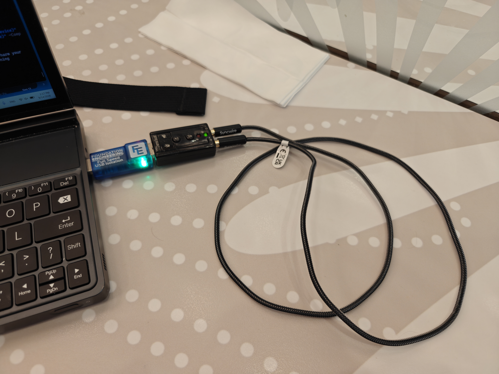

# RADE Integration Verification Report

## Application Under Test

| Field | Value |
|---|---|
| Application name | FreeDV |
| Application version / git hash | 3.0.0-dev (git 69473b0) |
| Platform (OS + version) | Microsoft Windows Server 2022 Datacenter 10.0.20348 (build 20348) AMD64 (loopback)<br/>Microsoft Windows 11 Home 25H2 26200.9445 AMD64 (OTAC test) |
| Tester name / callsign | Mooneer Salem / K6AQ |
| Date | 2026-09-16 |
| radae repo commit hash | 758e825182f3a216922fb4bbd7f9a4f5c6fe4288 |
| rade_c repo commit hash | 7eda42f0f10ec5df6ff409527f5855d5b3ed1c94 |

## Signal Path Declaration

- [x] No additional signal processing (AGC, noise gate, resampler, EQ,
      compression) between WAV file input and RADE encoder input during
      this verification test
      <!-- Asserted automatically: test/freedv-ctest-loss.conf.tmpl disables
           AGC, the mic/speaker EQ and Speex noise suppression, and the RADE
           path runs at a fixed 8/16 kHz with no resampling. -->

## Baseline Loss (Step 1)

Re-run with the current repository version before filling in this section.

| Field | Value |
|---|---|
| Baseline loss | 0.079 |
| 10% tolerance window | baseline ± 0.0079  (0.0711 — 0.0869) |

Command used:
```
rade_tx_wav --v2 -f baseline_txfeatures.f32 all.wav baseline_tx.wav
rade_rx_wav --v2 -f baseline_rxfeatures.f32 baseline_tx.wav baseline_decoded.wav
python3 loss.py baseline_txfeatures.f32 baseline_rxfeatures.f32 --clip_start 100 --clip_end 300
```

## Level 1 — Software Loopback (mandatory)

- [x] Pass (loss within ±10% of baseline)

| Field | Value |
|---|---|
| Loss result | 0.084  (PASS) |

Command used / reproduction notes:
```
# Result parsed from an existing run of the command below.
# From the FreeDV install / build directory (see
# .github/workflows/cmake-windows.yml for the virtual audio setup):
.\TestFreeDVRadeLoss.ps1 `
    -RadioToComputerDevice "<device>" -ComputerToRadioDevice "<device>" `
    -MicrophoneToComputerDevice "<device>" -ComputerToSpeakerDevice "<device>" -LossThreshold 0.0869

# loss.py invocation performed inside TestFreeDVRadeLoss.ps1:
python loss.py txfeatures.f32 rxfeatures.f32 `
    --loss_test <baseline x 1.10> --clip_start 100 --clip_end 300
```

## Level 2 — OTAC: Over The Audio Cable (mandatory for hardware integrations)

- [x] Pass (loss within ±10% of baseline)
- [ ] N/A (software-only integration)

| Field | Value |
|---|---|
| Loss result | 0.083 |
| Sound card (Tx) | Generalplus USB Audio Device (USB VID 0x1B3F, PID 0x2008) + USB isolator |
| Sound card (Rx) | Generalplus USB Audio Device (USB VID 0x1B3F, PID 0x2008) + USB isolator |
| Cable description | ~1 meter cable with 3.5mm ends |

Photo of test setup:


Reproduction notes:

```
Use Control Panel/Settings to set input/output audio levels to 50% and disable all audio enhancements.

PowerShell command line used:

.\\TestFreeDVRadeLoss.ps1 -RadioToComputerDevice "Microphone (2- USB Audio Device)" -ComputerToSpeakerDevice "Line 1 (Virtual Audio Cable)" -MicrophoneToComputerDevice "Line 2 (Virtual Audio Cable)" -ComputerToRadioDevice "Speakers (2- USB Audio Device)" -LossThreshold 0.0869

```

## Level 3 — OTC: Over The Coax (optional)

- [ ] Pass (loss within ±10% of baseline)
- [x] Not performed

| Field | Value |
|---|---|
| Loss result | |
| Tx radio | |
| Rx radio | |
| Attenuator(s) | |

Photo of test setup:
_(attach or link)_

Reproduction notes:
```
(paste notes here)
```

## Summary

| Level | Result |
|---|---|
| Level 1 — Software loopback | PASS |
| Level 2 — OTAC | PASS |
| Level 3 — OTC | N/A |

Additional notes:
