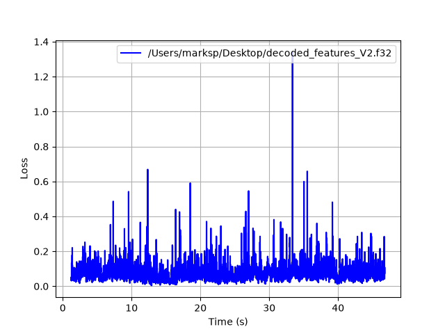
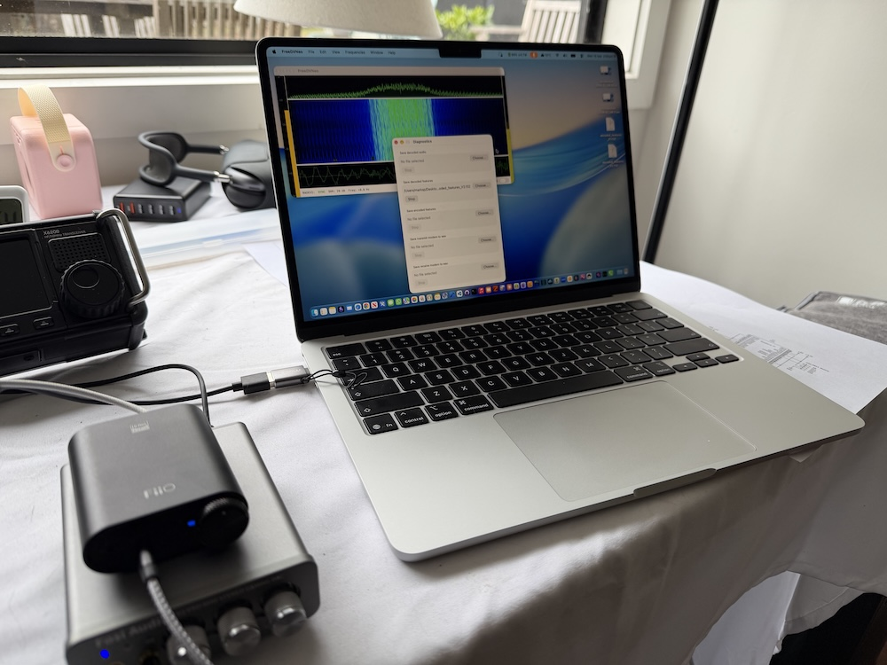
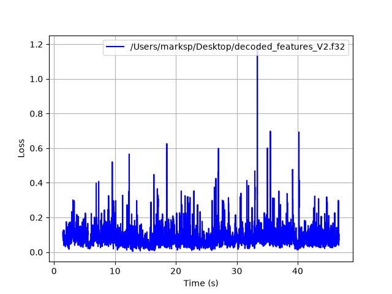
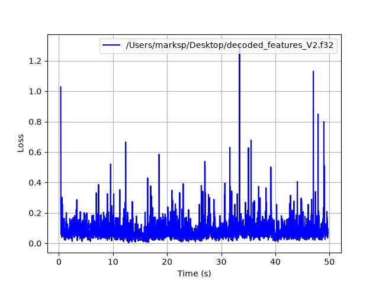

# RADE Integration Verification Report

## RADEV2

Following https://github.com/drowe67/radae/blob/dr-tx-bpf/doc/verification/verification_procedure.md

## Application Under Test

| Field | Value |
|---|---|
| Application name | FreeDVNeo |
| Application version / git hash | 1.2.18 a354254 |
| Platform (OS + version) | macOS 27 |
| Tester name / callsign | Peter Marks VK3TPM |
| Date | 2026-09-22 |
| radae repo commit hash | 758e825182f3 |
| rade_c repo commit hash | 262a980842 |

## Signal Path Declaration

- [X] No additional signal processing (AGC, noise gate, resampler, EQ,
      compression) between WAV file input and RADE encoder input during
      this verification test

## Baseline Loss (Step 1)

Re-run with the current repository version before filling in this section.

| Field | Value |
|---|---|
| Baseline loss | 0.079 |
| 10% tolerance window | 0.0711 - 0.0869 |

Command used:
```
marksp@Mac build % ./src/rade_tx_wav --v2 -f features_tx.f32 ../wav/all.wav tx.wav
Input: ../wav/all.wav  16000 Hz  1 ch  16-bit int
Speech input: 796227 samples @ 16000 Hz  (49.8 s)
rade_open: model_file=(unused, built-in weights) (ignored, using built-in weights)
rade_open: V2 n_features_in=144 Nmf=320 Neoo=960
Modem frames: 1244 + EOO
Output: tx.wav  49.9 s  (798080 bytes)

marksp@Mac build % ./src/rade_rx_wav --v2 -f features_rx.f32 tx.wav decoded.wav
Input: tx.wav  8000 Hz  1 ch  16-bit int
Modem input: 399040 samples @ 8000 Hz  (49.9 s)
rade_open: model_file=(unused, built-in weights) (ignored, using built-in weights)
rade_open: V2 n_features_in=144 Nmf=320 Neoo=960
End-of-over at input OFDM symbol 2491
Input OFDM symbols: 2494   valid: 1239   SNR: 19.3 dB
Output: decoded.wav  49.5 s  (1584320 bytes)

# cd to radae directory
marksp@Mac radae % python3 -m venv venv
marksp@Mac radae % source venv/bin/activate
pip install numpy torch matplotlib

(venv) marksp@Mac radae % python3 loss.py ../rade_c/build/features_tx.f32 ../rade_c/build/features_rx.f32 --clip_start 100 --clip_end 300
Loss between ../rade_c/build/features_tx.f32 and ../rade_c/build/features_rx.f32
  loss: 0.079 start: 224 acq_time:  1.24 s


```

## Level 1 — Software Loopback (mandatory)

- [X] Pass (loss within ±10% of baseline)

| Field | Value |
|---|---|
| Loss result | 0.081 |

Command used / reproduction notes:

In the FreeDVNeo app

- Switch on RADEV2
- Choose all.wav as the transmit speech from wav file
- Diagnostics, save encoded features to encoded_features_V2.f32
- Diagnostics, save transmit modem to wav modem_v2.wav
- Enable transmit to do the encoding.
- Diagnostics, save decoded features to decoded_features_V2.f32
- Choose modem_v2.wav as decode from modem wav file


```
(venv) marksp@Mac radae % python3 loss.py ~/Desktop/encoded_features_V2.f32 ~/Desktop/decoded_features_V2.f32 --clip_start 100 --clip_end 300 --plot
Loss between /Users/marksp/Desktop/encoded_features_V2.f32 and /Users/marksp/Desktop/decoded_features_V2.f32
  loss: 0.081 start: 224 acq_time:  1.24 s

```



## Level 2 — OTAC: Over The Audio Cable (mandatory for hardware integrations)

- [X] Pass (loss within ±10% of baseline)
- [ ] N/A (software-only integration)

| Field | Value |
|---|---|
| Loss result | 0.085 |
| Sound card (Tx) | FiiO DAC |
| Sound card (Rx) | Fosi Audio DAC |
| Cable description | 3.5mm 0.3m audio cable |

Photo of test setup:


Reproduction notes:
```
(venv) marksp@Mac radae % python3 loss.py ~/Desktop/encoded_features_V2.f32 ~/Desktop/decoded_features_V2.f32 --clip_start 100 --clip_end 300 --plot
Loss between /Users/marksp/Desktop/encoded_features_V2.f32 and /Users/marksp/Desktop/decoded_features_V2.f32
  loss: 0.085 start: 244 acq_time:  1.44 s
```


## Level 3 — OTC: Over The Coax (optional)

- [X] Pass (loss within ±10% of baseline)
- [ ] Not performed

| Field | Value |
|---|---|
| Loss result | 0.082 |
| Tx radio | IC-705 |
| Rx radio | Xiegu X6200 |
| Attenuator(s) | 40dB + 40dB + 20dB |

Photo of test setup:


Reproduction notes:
```
(venv) marksp@Peters-M4-Mini radae % python3 loss.py ~/Desktop/encoded_features_V2.f32 ~/Desktop/decoded_features_V2.f32 --clip_start 10 --clip_end 10 --plot
Loss between /Users/marksp/Desktop/encoded_features_V2.f32 and /Users/marksp/Desktop/decoded_features_V2.f32
  loss: 0.082 start: 134 acq_time:  0.34 s
```

 

## Summary

| Level | Result |
|---|---|
| Level 1 — Software loopback | PASS |
| Level 2 — OTAC | PASS |
| Level 3 — OTC | PASS |

Additional notes:

My first over the cable (OTC) test failed as outside the 10% limit. I was over-driving
the transmitter into ALC. Reducing drive to just a little ALC improved the result.
