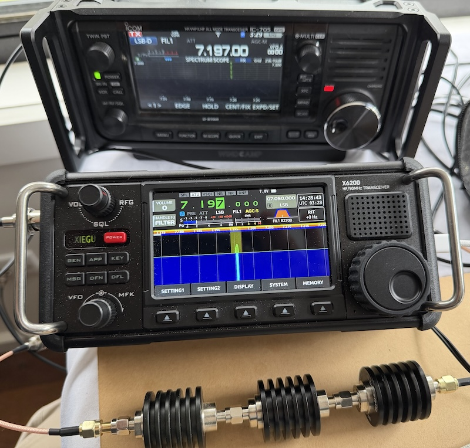

# RADE Integration Verification Report

## Application Under Test

| Field | Value |
|---|---|
| Application name | FreeDVNeo |
| Application version / git hash | 1.2.3 |
| Platform (OS + version) | macOS 26.6 |
| Tester name / callsign | Peter Marks VK3TPM |
| Date | 2026-07-28 |
| radae repo commit hash | 25d58fe30e3765444d8e2a70133f7f39095c50ca |
| rade_c repo commit hash | a36161bce0fb37daf3f4602344b095f6817dddb1 |
| freedv-backend commit hash | 5a4210b7548426571b2dd7635e1585dfb7fad098 |

## Signal Path Declaration

- [x] No additional signal processing (AGC, noise gate, resampler, EQ,
      compression) between WAV file input and RADE encoder input during
      this verification test

## Baseline Loss (Step 1)

Re-run with the current repository version before filling in this section.

| Field | Value |
|---|---|
| Baseline loss | 0.081 |
| 10% tolerance window | 0.0729 - 0.0891 |

Command used:
```
marksp@Peters-M4-Mini radae % ./build/src/lpcnet_demo -features wav/all.wav features_in.f32
(venv) marksp@Peters-M4-Mini radae % python3 tx2.py 250725/checkpoints/checkpoint_epoch_200.pth features_in.f32 tx.f32
encoder: 916440
decoder: 1462132
decoder stateful: 905460
d: 56 fs: 4 Tz: 0.040 Rs: 50.00 Rs': 62.50 Ts': 0.016 Nsmf:  28 Ns:   2 Nc:  14 M: 128 Ncp: 32
Processing: 4976 feature vectors
(venv) marksp@Peters-M4-Mini radae % python3 rx2.py 250725/checkpoints/checkpoint_epoch_200.pth 250725a_ml_sync tx.f32 features_rx.f32 --quiet
encoder: 916440
decoder: 1462132
decoder stateful: 1462132
d: 56 fs: 4 Tz: 0.040 Rs: 50.00 Rs': 62.50 Ts': 0.016 Nsmf:  28 Ns:   2 Nc:  14 M: 128 Ncp: 32
samples: 399040 Nmf: 320 modem frames: 1247
Input BPF bandwidth: 975.000000 centre: 1468.750000
2494
n_acq: 1
latent vectors: 1239
(venv) marksp@Peters-M4-Mini radae % python3 loss.py features_in.f32 features_rx.f32 --clip_start 100 --clip_end 300
Loss between features_in.f32 and features_rx.f32
  loss: 0.081 start: 224 acq_time:  1.24 s
```

## Level 1 — Software Loopback (mandatory)

- [x] Pass (loss within ±10% of baseline)

| Field | Value |
|---|---|
| Loss result | 0.088 |

Command used / reproduction notes:
```
python3 loss.py ~/Desktop/encoded_features_V2.f32 ~/Desktop/decoded_features_V2.f32 --plot --clip_start=11
Loss between /Users/marksp/Desktop/encoded_features_V2.f32 and /Users/marksp/Desktop/decoded_features_V2.f32
  loss: 0.088 start: 135 acq_time:  0.35 s
```

## Level 2 — OTAC: Over The Audio Cable (mandatory for hardware integrations)

- [ ] Pass (loss within ±10% of baseline)
- [x] N/A (software-only integration)

| Field | Value |
|---|---|
| Loss result | |
| Sound card (Tx) | |
| Sound card (Rx) | |
| Cable description | |

Photo of test setup:
_(attach or link)_

Reproduction notes:
```
(paste notes here)
```

## Level 3 — OTC: Over The Coax (optional)

- [ ] Pass (loss within ±10% of baseline)
- [ ] Not performed

| Field | Value |
|---|---|
| Loss result | 0.090 |
| Tx radio | Icom IC-705 |
| Rx radio | Xiegu X6200 |
| Attenuator(s) | 20dB + 40dB + 40dB = 100dB |

Photo of test setup:


Reproduction notes:
```
python3 loss.py ~/Desktop/encoded_features_V2.f32 ~/Desktop/decoded_features_V2.f32 --plot --clip_start=10
Loss between /Users/marksp/Desktop/encoded_features_V2.f32 and /Users/marksp/Desktop/decoded_features_V2.f32
  loss: 0.090 start: 134 acq_time:  0.34 s
```

## Summary

| Level | Result |
|---|---|
| Level 1 — Software loopback | PASS |
| Level 2 — OTAC | N/A |
| Level 3 — OTC | FAIL |

Additional notes:

OTC is very close but failed the 10% from baseline at this point.