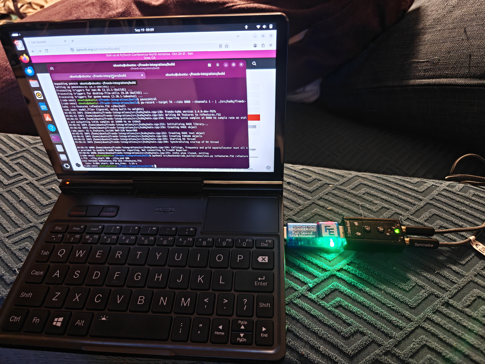

# RADE Integration Verification Report

## Application Under Test

| Field | Value |
|---|---|
| Application name | freedv-ka9q |
| Application version / git hash | [f07b29d](https://github.com/tmiw/freedv-integrations/pull/15/commits/f07b29daaba711c58cbf475cdda93061d4d55543) |
| Platform (OS + version) | Ubuntu 26.01.1 LTS, kernel 7.0.0-30-generic, x86_64 
| Tester name / callsign | Mooneer Salem / K6AQ |
| Date | 2026-09-19 |
| radae repo commit hash | [0ba4e95](https://github.com/drowe67/radae/commit/0ba4e9502627178cf092c535fb6fbec9c367d397) |
| rade_c repo commit hash | [7eda42f](https://github.com/freedv/rade_c/commit/7eda42f0f10ec5df6ff409527f5855d5b3ed1c94) |

## Signal Path Declaration

- [x] No additional signal processing (AGC, noise gate, resampler, EQ,
      compression) between WAV file input and RADE encoder input during
      this verification test

## Baseline Loss (Step 1)

Re-run with the current repository version before filling in this section.

| Field | Value |
|---|---|
| Baseline loss | 0.079 |
| 10% tolerance window | baseline ± 0.0079 |

Command used:
```
$ pwd
/home/ubuntu/freedv-integrations/build/src/backend/rade_build
$ ./src/rade_tx_wav -f txfeatures.f32 ../rade_src/wav/all.wav tx.wav --v2
$ ./src/rade_rx_wav -f rxfeatures.f32 tx.wav rx.wav --v2
$ git clone https://github.com/drowe67/radae.git
$ python3 radae/loss.py txfeatures.f32 rxfeatures.f32 --clip_start 100 --clip_end 300
```

## Level 1 — Software Loopback (mandatory)

- [x] Pass (loss within ±10% of baseline)

| Field | Value |
|---|---|
| Loss result | 0.079 |

Command used / reproduction notes:
```
# (note: assumes baseline loss commands executed above)

$ pwd
/home/ubuntu/freedv-integrations/build
$ cp src/backend/rade_build/tx.wav .
$ cp src/backend/rade_build/txfeatures.f32 .
$ sox tx.wav -t raw -r 8000 -c 1 -b 16 -e signed-integer - | ./src/ka9q/freedv-ka9q --rx-features rxfeatures.f32 >/dev/null
$ python3 src/backend/rade_build/radae/loss.py txfeatures.f32 rxfeatures.f32 --clip_start 100 --clip_end 300
```

## Level 2 — OTAC: Over The Audio Cable (mandatory for hardware integrations)

- [x] Pass (loss within ±10% of baseline)
- [ ] N/A (software-only integration)

| Field | Value |
|---|---|
| Loss result | 0.081 |
| Sound card (Tx) | N/A |
| Sound card (Rx) | Generalplus USB Audio Device (USB VID 0x1B3F, PID 0x2008) + USB isolator |
| Cable description | ~1m 3.5mm cable |

Photo of test setup:


Reproduction notes:
```
# (Assumes Level 1 done above.)
# Use wpctl status to get correct target IDs for pw-record/pw-play.
# Also, use pavucontrol or similar to adjust input and output to 50% volume.

# In first terminal window
$ pwd
/home/ubuntu/freedv-integrations/build
$ pw-record --target 74 --rate 8000 --channels 1 - | ./src/ka9q/freedv-ka9q --rx-features rxfeatures.f32 >/dev/null &

# In another terminal
$ pwd
/home/ubuntu/freedv-integrations/build
$ pw-play --target 73 tx.wav

# Needed to flush rest of audio through pipewire
$ sox -n silence.wav trim 0 10
$ pw-play --target 73 silence.wav 
$ killall pw-record
 
# Back in first terminal window
$ python3 src/backend/rade_build/radae/loss.py txfeatures.f32 rxfeatures.f32 --clip_start 100 --clip_end 300
```

## Level 3 — OTC: Over The Coax (optional)

- [ ] Pass (loss within ±10% of baseline)
- [x] Not performed

| Field | Value |
|---|---|
| Loss result | |
| Tx radio | |
| Rx radio | |
| Attenuator(s) | |

Photo of test setup:
_(attach or link)_

Reproduction notes:
```
(paste notes here)
```

## Summary

| Level | Result |
|---|---|
| Level 1 — Software loopback | PASS |
| Level 2 — OTAC | PASS / FAIL / N/A |
| Level 3 — OTC | N/A |

Additional notes:
