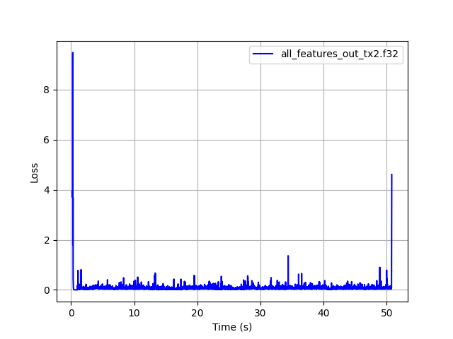
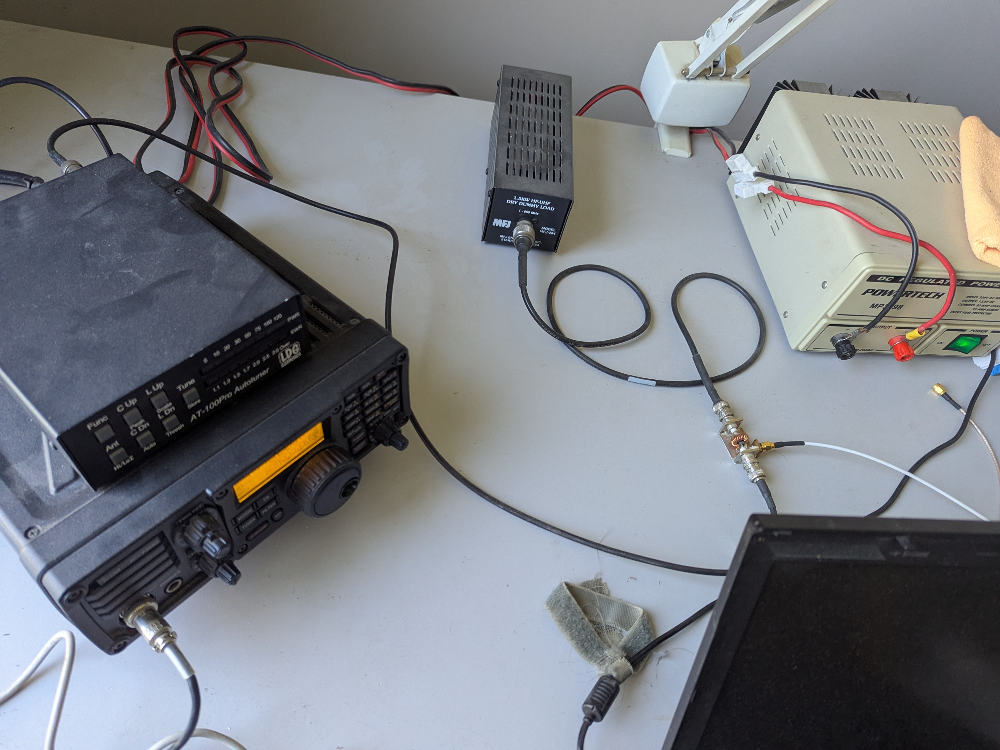
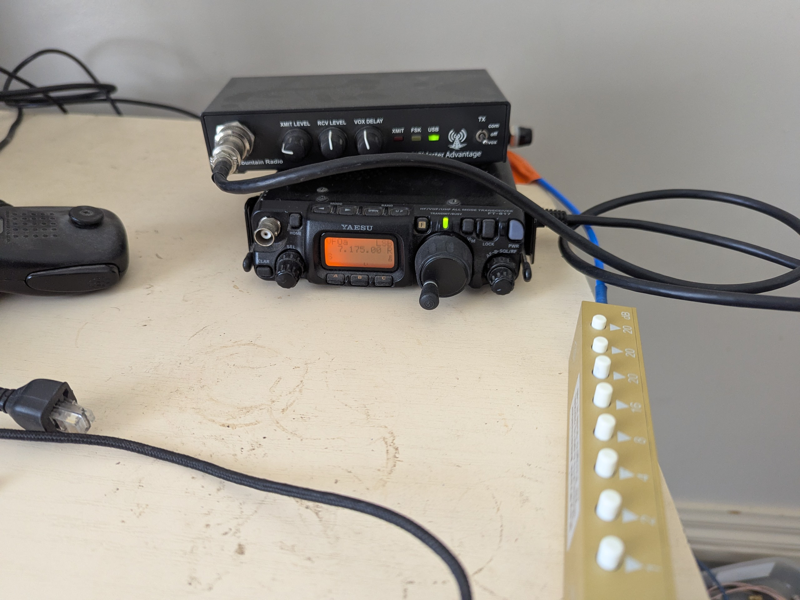
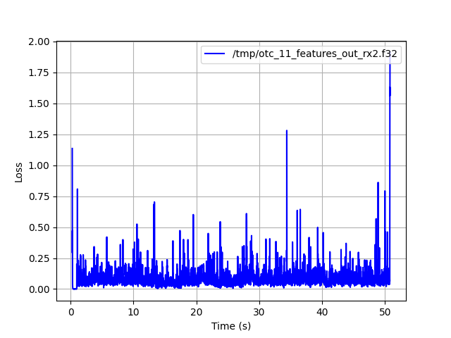

# RADE Integration Verification Report

## Application Under Test

| Field | Value |
|---|---|
| Application name | `ota_test.sh` (radae repo reference OTC/OTA test script, `rade_c` backend via `--v2_c`) |
| Application version / git hash | radae `631ebb3` (see radae repo commit hash below — `ota_test.sh` is tracked in this repo) |
| Platform (OS + version) | Ubuntu 22.04.3 LTS, kernel 5.15.0-86-generic, x86_64 |
| Tester name / callsign | David Rowe / VK5DGR |
| Date | 2026-09-22 |
| radae repo commit hash | [631ebb3](https://github.com/drowe67/radae/commit/631ebb3) |
| rade_c repo commit hash | [7eda42f](https://github.com/freedv/rade_c/commit/7eda42f0f10ec5df6ff409527f5855d5b3ed1c94) |

## Signal Path Declaration

- [x] No additional signal processing (AGC, noise gate, resampler, EQ,
      compression) between WAV file input and RADE encoder input during
      this verification test

## Baseline Loss (Step 1)

| Field | Value |
|---|---|
| Baseline loss | 0.080 |
| 10% tolerance window | 0.072 - 0.088 |

Command used:
```
cd ~/radae
./ota_test.sh wav/all.wav --v2_c -x
python3 loss.py all_features_in_tx2.f32 all_features_out_tx2.f32 --clip_start 100 --clip_end 300
```

Output:
```
Loss between all_features_in_tx2.f32 and all_features_out_tx2.f32
  loss: 0.080 start: 224 acq_time:  1.24 s
```

**Note on 0.080 vs the 0.079 reference baseline:** `ota_test.sh` inserts 1
second of silence at the start of the input speech before RADE encoding
(to ease receiver sync during the later chirp/SSB/RADE1/RADE2 segmentation
at Rx). This does not shift the acquisition transient itself — a direct,
unpadded `rade_tx_wav`/`rade_rx_wav` loopback on the same `rade_c` commit
reproduces the documented `0.079, start: 224, acq_time: 1.24s` exactly —
but it does change the total sequence length, so `--clip_end 300` (counted
from the end) trims a very slightly different span. The 0.001 delta is a
second-order alignment effect from the extra padding, well inside the ±10%
tolerance either way. **0.080 (this script's own self-generated baseline)
is used as the reference point below**, rather than the plain 0.079, since
comparing OTC results against the baseline produced by the same pipeline
that produced them is the correct apples-to-apples comparison.

Unclipped loss plot (illustrative — shows the acquisition transient
discussed above; the 0.088 figure on this plot is the *unclipped* loss,
not the reported baseline):



## Level 1 — Software Loopback (mandatory)

- [x] Pass (loss within ±10% of baseline)

| Field | Value |
|---|---|
| Loss result | 0.080 |

Command used / reproduction notes: **Same as Step 1 (Baseline) above.**

Identical to the baseline generation above — `ota_test.sh -x --v2_c` runs
the full `rade_c` V2 encode/decode pipeline in software loopback (no
hardware) as part of producing the Tx reference and genie-decoded features,
so this step and Step 1 are the same measurement for this application.

## Level 2 — Over The Audio Cable / OTAC

- [ ] Pass (loss within ±10% of baseline)
- [ ] N/A (software-only integration)

Not performed. Level 3 (OTC) was performed instead, satisfying the "at
least one of Level 2 or Level 3 is mandatory" requirement.

## Level 3 — OTC: Over The Coax (optional)

- [x] Pass (loss within ±10% of baseline, all three runs)
- [ ] Not performed

Three OTC hardware runs (`rade_c`/C engine) from the 2026-09-05 OTC test
campaign, reprocessed against the current `rade_c` commit (`7eda42f`) and
current `radae` `loss.py` with the procedure's `--clip_start 100
--clip_end 300`.

| Run | Baseline (loopback) | OTC loss | Δ | acq_time | Result |
|---|---|---|---|---|---|
| otc-09 | 0.080 | 0.082 | 0.002 | 1.24 s | PASS |
| otc-10 | 0.080 | 0.082 | 0.003 | 1.48 s | PASS |
| otc-11 | 0.080 | 0.084 | 0.004 | 1.28 s | PASS |

| Field | Value |
|---|---|
| Tx radio | IC-7200, driven from a separate laptop ("bear") in another room for physical isolation |
| Rx radio | FT-817 (7.175 MHz LSB), via a Mountain Radio interface to `deep` |
| Attenuator(s) | RF sampler off the IC-7200 (~-45dB tap used; 0dB port terminated into an MFJ-264 dummy load) → 30dB barrel attenuator → hybrid splitter (one leg to a spectrum analyser for monitoring, other to the coax run) → coax to the other room → switched step attenuator (40dB, 2×20dB steps) → FT-817 |

Photo of test setup:


*Tx: IC-7200 (with LDG AT-100Pro autotuner) driven from "bear", a laptop in
another room. RF sampler at centre (small PCB with BNCs and toroid) taps
~-45dB off the Tx output for the signal path; the 0dB port is terminated
into an MFJ-264 dummy load. Out of shot at right is a 30dB barrel
attenuator, and a Mini-Circuits hybrid splitter to allow monitoring on a
spec-an. To enhance RF isolation the Tx is in a separate room from the Rx,
connected using 15m of low-loss UHF-grade CNT-240 coax.*


*Rx: FT-817 (7.175 MHz LSB) with a Mountain Radio interface to `deep`, with
40dB (2×20dB) Rx-side attenuation via the step attenuator, giving an
S7-8 signal at the Rx.*

Reproduction notes:
```
# On "bear" (Tx machine, driving the IC-7200):

# 1. Create tx.raw (once):
./ota_test.sh wav/all.wav --v2_c -x -d

# 2. Transmit it (each time you want to Tx):
./ota_test.sh tx.raw -t -d -o 3061 -f 7175

# On "deep" (Rx machine):

# 1. Generate the local Tx reference / baseline (once, also Step 1 above):
./ota_test.sh wav/all.wav --v2_c -x

# 2. Start recording just before Tx begins (e.g. via Audacity), saving to
#    e.g. ~/Downloads/260905-otc-09.wav

# 3. Process the recording and measure loss:
./ota_test.sh --v2_c -r <recording>.wav -l wav/all.wav

# This will print the loss value at the end using the default `--clip_start 25`.  For consistency with the verification procedure, re-run the loss calculation with:

python3 loss.py all_features_in_tx2.f32 all_features_out_tx2.f32 \
    --features_hat2 features_out_rx2.f32 --compare --delta 0.008 \
    --clip_start 100 --clip_end 300
```

Adapted from [drowe67's comment on peterbmarks/radae_nopy#14](https://github.com/peterbmarks/radae_nopy/pull/14#issuecomment-4997440359),
which predates `--v2_c` — added here for the C-engine runs reported below.

Unclipped loss plot for otc-11 (illustrative — the 0.085 figure on this
plot is the *unclipped* loss; the reported, clipped result is 0.084 per
the table above):



Only the C-engine runs from the 2026-09-05 campaign (otc-09/10/11) are
included here — otc-12/13/14 from the same session used the Python
reference engine and are out of scope for a `rade_c` verification report.
See [freedv/rade_c#20 comment](https://github.com/freedv/rade_c/issues/20#issuecomment-5547997120)
for the full six-run C-vs-Python comparison this report draws from.

## Summary

| Level | Result |
|---|---|
| Level 1 — Software loopback | PASS |
| Level 2 — OTAC | N/A (Level 3 performed instead) |
| Level 3 — OTC | PASS |

Additional notes:
