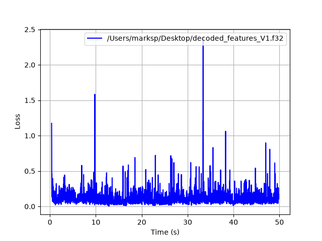
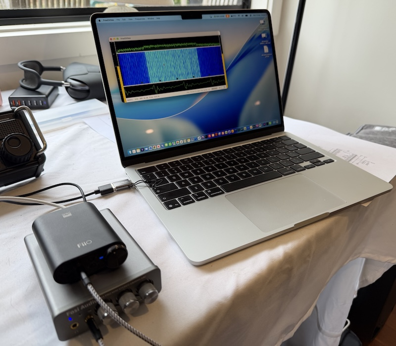
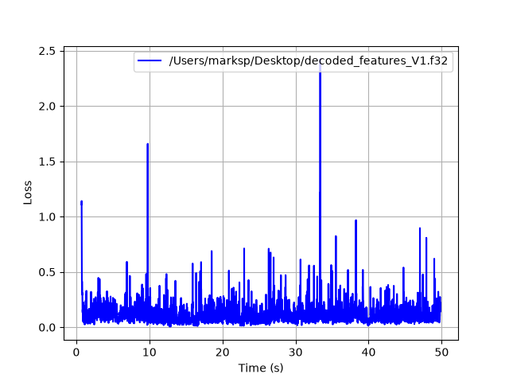
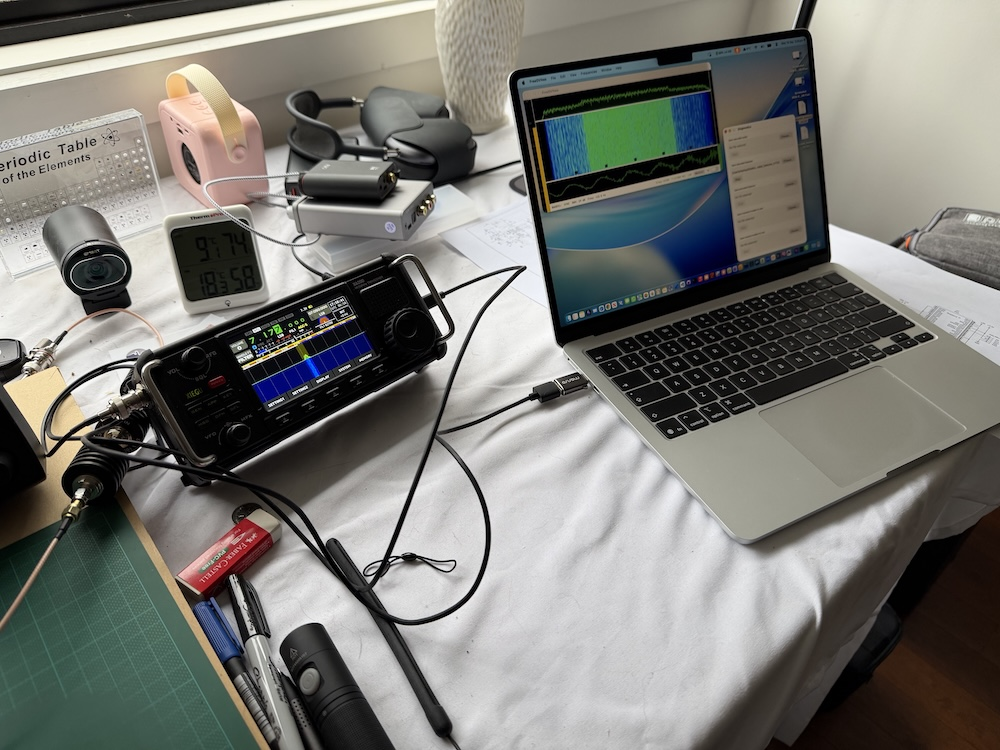
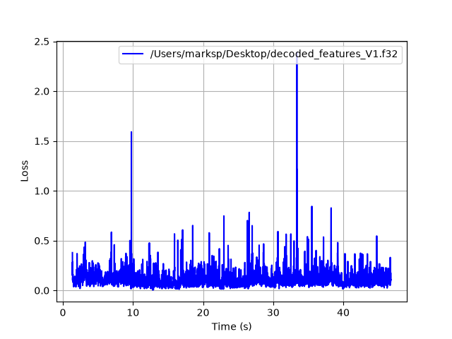

# RADE Integration Verification Report

## Application Under Test

| Field | Value |
|---|---|
| Application name | FreeDVNeo |
| Application version / git hash | 1.2.18 a354254 |
| Platform (OS + version) | macOS 27 |
| Tester name / callsign | Peter Marks VK3TPM |
| Date | 2026-09-16 |
| radae repo commit hash | 758e825182f3 |
| rade_c repo commit hash | 262a980842 |

## Signal Path Declaration

- [X] No additional signal processing (AGC, noise gate, resampler, EQ,
      compression) between WAV file input and RADE encoder input during
      this verification test

## Baseline Loss (Step 1)

Re-run with the current repository version before filling in this section.

| Field | Value |
|---|---|
| Baseline loss | 0.115 |
| 10% tolerance window | 0.1035 - 0.1265 |

Command used:
```
marksp@Mac build % ./src/rade_tx_wav -f features_tx.f32 ../wav/all.wav tx.wav 
Input: ../wav/all.wav  16000 Hz  1 ch  16-bit int
Speech input: 796227 samples @ 16000 Hz  (49.8 s)
rade_open: model_file=(unused, built-in weights) (ignored, using built-in weights)
rade_open: V1 n_features_in=432 Nmf=960 Neoo=1152 n_eoo_bits=180
Modem frames: 415 + EOO
Output: tx.wav  49.9 s  (799104 bytes)

marksp@Mac build % ./src/rade_rx_wav -f features_rx.f32 tx.wav decoded.wav 
Input: tx.wav  8000 Hz  1 ch  16-bit int
Modem input: 399552 samples @ 8000 Hz  (49.9 s)
rade_open: model_file=(unused, built-in weights) (ignored, using built-in weights)
rade_open: V1 n_features_in=432 Nmf=960 Neoo=1152 n_eoo_bits=180
# lots of output redacted
End-of-over at input OFDM symbol 416
Input OFDM symbols: 417   valid: 412   SNR: 34.8 dB
Output: decoded.wav  49.4 s  (1580480 bytes)

# cd to radae directory
marksp@Mac radae % python3 -m venv venv
marksp@Mac radae % source venv/bin/activate
pip install numpy torch matplotlib

(venv) marksp@Mac radae % python3 loss.py ../rade_c/build/features_tx.f32 ../rade_c/build/features_rx.f32 --plot                             
Loss between ../rade_c/build/features_tx.f32 and ../rade_c/build/features_rx.f32
  loss: 0.116 start: 136 acq_time:  0.36 s
```

## Level 1 — Software Loopback (mandatory)

- [X] Pass (loss within ±10% of baseline)

| Field | Value |
|---|---|
| Loss result | 0.115 |

Command used / reproduction notes:

In the FreeDVNeo app

- Choose all.wav as the transmit speech from wav file
- Diagnostics, save encoded features to encoded_features_V1.f32
- Diagnostics, save transmit modem to wav modem_v1.wav
- Enable transmit to do the encoding.
- Diagnostics, save decoded features to decoded_features_V1.f32
- Choose modem_v1.wav as decode from modem wav file


```
python3 loss.py ~/Desktop/encoded_features_V1.f32 ~/Desktop/decoded_features_V1.f32 --plot
Loss between /Users/marksp/Desktop/encoded_features_V1.f32 and /Users/marksp/Desktop/decoded_features_V1.f32
  loss: 0.115 start: 136 acq_time:  0.36 s

```



## Level 2 — OTAC: Over The Audio Cable (mandatory for hardware integrations)

- [X] Pass (loss within ±10% of baseline)
- [ ] N/A (software-only integration)

| Field | Value |
|---|---|
| Loss result | 0.115 |
| Sound card (Tx) | FiiO DAC |
| Sound card (Rx) | Fosi Audio DAC|
| Cable description | 3.5mm audio cable 0.3m|

Photo of test setup:


Reproduction notes:
```
Two Mac computers used. Audio from one fed in to a FiiO DAC.
Cable from headphone out on FiiO to Fosi Audio Stereo Gaming DAC.
Level adjusted for best SNR of about 35dB
all.wav transmitted.
Features captured on receiving side to file.
decoded_features_V1.f32 from receiving mac copied over.

(venv) marksp@Mac radae % python3 loss.py ~/Desktop/encoded_features_V1.f32 ~/Desktop/decoded_features_V1.f32 --plot
Loss between /Users/marksp/Desktop/encoded_features_V1.f32 and /Users/marksp/Desktop/decoded_features_V1.f32
  loss: 0.115 start: 172 acq_time:  0.72 s
```



## Level 3 — OTC: Over The Coax (optional)

- [X] Pass (loss within ±10% of baseline)
- [ ] Not performed

| Field | Value |
|---|---|
| Loss result | 0.114 |
| Tx radio | IC-705 |
| Rx radio | Xiegu X6200 |
| Attenuator(s) | 40db + 40dB + 20dB |

Photo of test setup:


Reproduction notes:
```
(venv) marksp@Mac radae % python3 loss.py ~/Desktop/encoded_features_V1.f32 ~/Desktop/decoded_features_V1.f32 --clip_start 100 --clip_end 300 --plot
Loss between /Users/marksp/Desktop/encoded_features_V1.f32 and /Users/marksp/Desktop/decoded_features_V1.f32
  loss: 0.114 start: 236 acq_time:  1.36 s
```


## Summary

| Level | Result |
|---|---|
| Level 1 — Software loopback | PASS |
| Level 2 — OTAC | PASS |
| Level 3 — OTC | PASS |

Additional notes:
