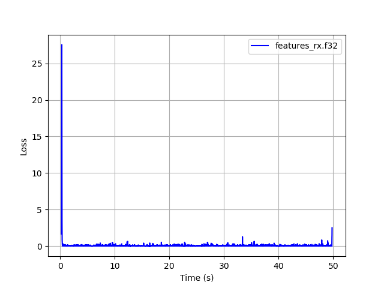
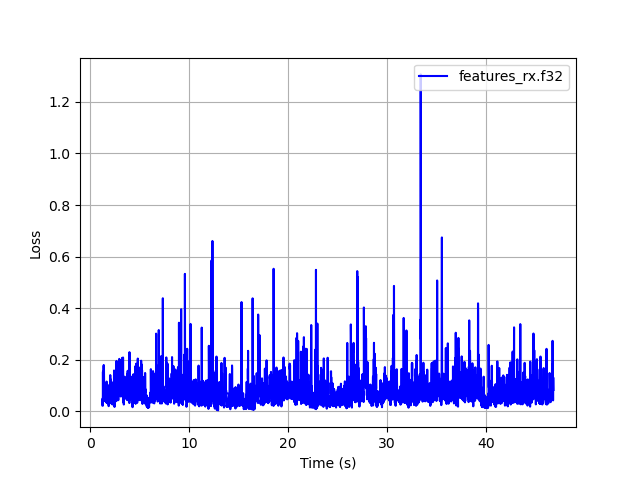

# RADE Integration Verification Procedure

## Purpose

This procedure verifies that RADE is correctly integrated into an application, SDR
or hardware radio. The goal is to confirm the signal path is clean — no dropped
sample buffers, no unintended DSP, no scaling errors — so that any on-air results
reflect RADE performance, not integration issues.

**Scope:** This procedure tests integration correctness only. It does not
evaluate speech quality, compare V1 vs V2, or directly assess radio hardware
performance. Any additional tests beyond this procedure should be agreed with
the RADE team before being submitted as results.

## Requirements

- The application must be able to export feature vectors at the RADE encoder
  input (Tx) and RADE decoder output (Rx) to disk files, for use with `loss.py`.
  See `rade_tx_wav -f` and `rade_rx_wav -f` in the rade_c repo, and the
  `rade_c_v2_wav` ctest, for worked examples.
- **RX-only applications** (no transmit capability) should use `tx2.py` from
  this repository as the reference transmitter, generating the TX WAV at
  test time so it tracks any model changes. For OTAC and OTC tests, the TX
  WAV must be played using a simple command-line tool with no signal
  processing (e.g. `aplay`, `afplay`, or `ffplay`). See the RX-only worked
  example below.
- The signal path must have a transfer function of 1 in both directions —
  **no additional signal processing** (AGC, noise gate, resampler, EQ,
  compression) between WAV file input and RADE encoder input, or between
  RADE decoder output and the exported feature files.
- Tests must use `wav/all.wav` (56 seconds, 16 kHz mono) from this repository.
- `loss.py` must be from this repository (not a local copy) to ensure consistency.

## Test Levels

### Scope

We need to test the full application including DAC/ADC hardware and drivers, as this is a common source of bugs (dropped buffers, sample rate mismatches, bit depth errors). For laptop/Desktop/mobile device applications that use sound card I/O, this should include the sound cards.  In this case, consider an OTAC and/or OTC test (as an OTC test includes all of the application driver code and ADC/DAC hardware).

For SDRs or hardware radios, or applications that connect to board ADC/DAC hardware on radios (e.g. internal USB sound cards), an Over the Cable (OTC) may be the only possible choice.

**At least one of Level 2 or Level 3 is mandatory; doing both is optional.**

**Over The Air (OTA) tests are not part of this procedure.** The radio channel
introduces uncontrolled variables that make loss measurements unrepeatable.

### Level 1 — Software Loopback (mandatory)

File in → application Tx → application Rx → file out, no hardware.

Establishes that the application's RADE signal path is correct in software
before any hardware is introduced.

### Level 2 — Over The Audio Cable / OTAC

Speech WAV → application → **sound card out → audio cable → sound card in** →
application → decoded WAV.

Tests the complete audio path including sound drivers, which are a common source of bugs (dropped buffers, sample rate mismatches, bit depth errors).

### Level 3 — Over The Coax / OTC

Full RF path: application → DAC → HF Tx → attenuator → coax → attenuator →
HF Rx → ADC → application.

Tests the complete hardware chain.

## Step-by-Step Procedure

### Step 1 — Establish the current baseline

Re-run the following with the latest version of this repository to obtain the
current software-only baseline. Do not use a cached value — the baseline shifts
slightly between model versions.

```
cd ~/radae
lpcnet_demo -features wav/all.wav features_in.f32
python3 tx2.py 250725/checkpoints/checkpoint_epoch_200.pth features_in.f32 tx.f32
python3 rx2.py 250725/checkpoints/checkpoint_epoch_200.pth 250725a_ml_sync tx.f32 features_rx.f32 --quiet
python3 loss.py features_in.f32 features_rx.f32 --clip_start 100 --clip_end 300
```

Example output (Python reference, `wav/all.wav`, model `250725`, commit `b549586`):
```
loss: 0.081 start: 224 acq_time:  1.24 s
```

Record the current baseline loss value and the git commit hash used
(e.g. `git log --oneline -1` → `cafebabe`). **A pass is within ±10% of the baseline.**

### Step 2 — Level 1: Software loopback

Run `wav/all.wav` through your application's full encode/decode pipeline with no
hardware, exporting feature vectors at encoder input and decoder output. Then:

```
python3 loss.py features_tx.f32 features_rx.f32 --clip_start 100 --clip_end 300
```

Pass criterion: loss within ±10% of baseline.

### Step 3 — Level 2: OTAC (hardware integrations)

Connect sound card output to sound card input via audio cable (no radio, no RF).
Run the same test as Step 2 with the audio routed through the hardware path.

Pass criterion: loss within ±10% of baseline.

### Step 4 — Level 3: OTC (SDR or full RF path)

Connect Tx and Rx via coax with appropriate attenuators. Run the same test.

Pass criterion: loss within ±10% of baseline.

## Worked Example of Loss Tests

The following example uses the rade_c WAV tools as the device under test
to demonstrate the full loss measurement workflow, including how to identify
and clip start/end transients. You may notice similar transients when testing
your own application or radio — it is good practice to remove them, as they
inflate the mean loss and can mask the true integration performance.

Run a V2 software loopback from the `rade_c/build` directory, exporting
feature vectors at both ends:

```
./src/rade_tx_wav --v2 -f features_tx.f32 ../wav/all.wav tx.wav
./src/rade_rx_wav --v2 -f features_rx.f32 tx.wav decoded.wav
```

First pass — no clipping, `--plot` to inspect the loss curve:

```
python3 ~/radae/loss.py features_tx.f32 features_rx.f32 \
    --plot --png loss_unclipped.png
```



The spike at the start (~22) is the RADE acquisition transient; the smaller
spike at the end (~3) is the end-of-over frame. Both are expected behaviour
from the state machine. Clip them out and re-run:

```
python3 ~/radae/loss.py features_tx.f32 features_rx.f32 \
    --clip_start 100 --clip_end 300 \
    --plot --png loss_clipped.png
```



With transients removed, loss drops from 0.113 to 0.082 — consistent with
the reference baseline. `--clip_start 100` (1 s) and `--clip_end 300` (3 s)
are conservative defaults; your integration may need different values
depending on acquisition time. Use `--plot` to check.

### Automated pass/fail

To compare your application against the rade_c software reference without
needing to record the baseline loss manually, use `--features_hat2` and
`--compare`. First generate a software reference run:

```
./src/rade_rx_wav --v2 -f features_rx_ref.f32 tx.wav /dev/null
```

Then run your application (the DUT) on the same `tx.wav` to produce
`features_rx_dut.f32`, and compare:

```
python3 ~/radae/loss.py features_tx.f32 features_rx_ref.f32 \
    --features_hat2 features_rx_dut.f32 \
    --compare --delta 0.008 \
    --clip_start 100 --clip_end 300
```

Output:
```
loss1: 0.082 loss2: 0.082 delta: 0.000
PASS
```

`loss.py` prints `PASS` or `FAIL` and exits with code 0 or 1 respectively,
making it suitable for use in CI scripts. A `--delta` of 0.008 corresponds
to approximately ±10% of the V2 software loopback baseline (0.082).

### RX-only application

For applications with no transmit capability, use `tx2.py` to generate the
reference TX signal, then convert to a real-valued WAV for playback or
loopback testing. The `tx.f32` IQ file is already generated in Step 1.

Convert to a real-valued 8 kHz mono WAV:

```
python3 f32toint16.py --real --scale 16384 < tx.f32 | \
    sox -t s16 -r 8000 -c 1 - tx_real.wav
```

For a software loopback test, feed `tx_real.wav` directly to your
application's RX input and export `features_rx.f32`. For OTAC or OTC tests,
play `tx_real.wav` via a command-line audio player:

```
aplay tx_real.wav      # Linux
afplay tx_real.wav     # macOS
ffplay tx_real.wav     # Windows / cross-platform
```

Then measure loss against the TX features from Step 1:

```
python3 loss.py features_in.f32 features_rx.f32 \
    --clip_start 100 --clip_end 300
```

Expected output (V2, software loopback, `wav/all.wav`):
```
loss: 0.083 start: 224 acq_time:  1.24 s
```

## Submitting Results

Copy `doc/verification/template.md` to `doc/verification/<serial>-<application>.md`
(e.g. `001-freedv-gui.md`), fill it in, and submit as a PR or attach to the
relevant GitHub issue.

**Multi-platform applications** (Windows/Linux/Mac) must submit a separate
completed form for each platform, as sound hardware drivers differ.
